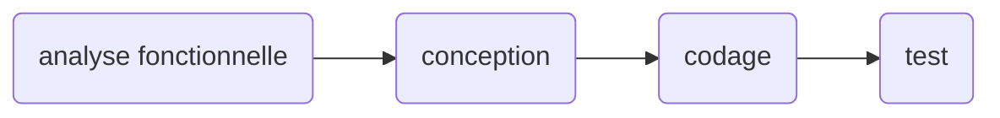
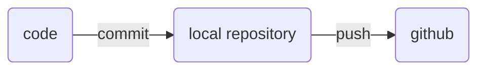

# Cycle de vie du logiciel #

## Description ##

## Implémentation ##
- codage / programmaion
- test
- analyse 
- conception

## Source Control ##
La gestion du code source.
On utlise git, mais il y a d'autre systèmes (subversion, mercurial)

Le flux quand on développe:

Mais avant il faut initier le repository:
